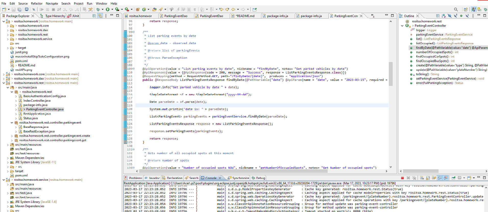
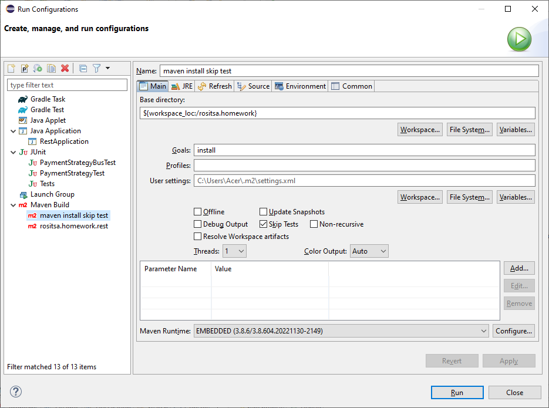
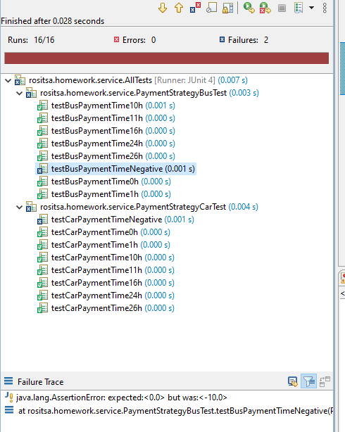
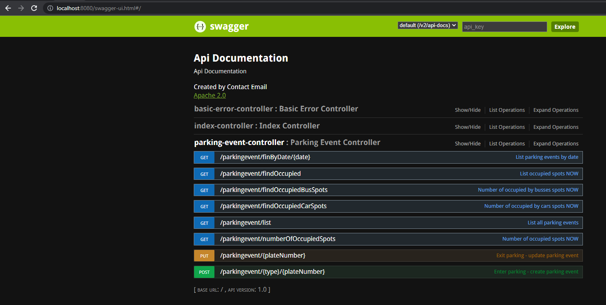

## rositsa.homework

### Development environment

Eclipse

### Java 

1.17

### Database

Engine MySQL;

Schema initialization

CREATE DATABASE `homework` /*!40100 DEFAULT CHARACTER SET utf8 */;

USE `homework`;

CREATE TABLE `parkingevent` (
  `id` int(11) NOT NULL AUTO_INCREMENT,
  `plateNumber` varchar(45) NOT NULL,
  `type` varchar(45) NOT NULL,
  `startTime` datetime NOT NULL,
  `endTime` datetime DEFAULT NULL,
  `spentTime` int(11) DEFAULT '0',
  `paidSumm` int(11) DEFAULT '0',
  PRIMARY KEY (`id`),
  UNIQUE KEY `id_UNIQUE` (`id`)
) ENGINE=MyISAM AUTO_INCREMENT=106 DEFAULT CHARSET=utf8;

INSERT INTO `homework`.`parkingevent`(`plateNumber`,`type`,`startTime`) VALUES ('CA9240A', 'CAR', '2023-03-16 12:00:00');

INSERT INTO `homework`.`parkingevent`(`plateNumber`,`type`,`startTime`) VALUES ('CB6495CA', 'BUS', '2023-03-16 20:30:00');

### Build

Maven install skipping tests

### Entry point

rositsa.homework.rest.RestApplication

### Unit tests

Price calculation test. Two of them was intentionally left to fail.

### REST APIs client

API Documentation is build using swagger. Swagger is available on: http://localhost:8080/swagger-ui.html

### Security

Jaas in memory basic authentication was used. Credentials are: username: parking, pwd: parking.

